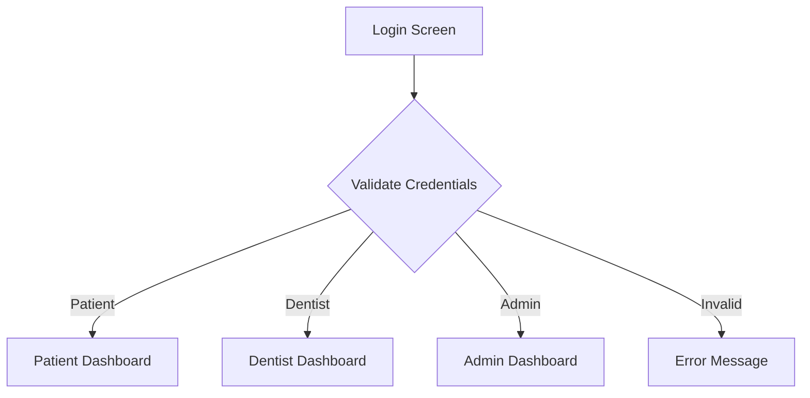

# 🦷 MOCards - Multi-Role Dental Loyalty System

<div align="center">

[](https://www.typescriptlang.org/)
[](https://reactjs.org/)
[](https://tailwindcss.com/)
[](https://vitejs.dev/)

**A comprehensive multi-role dental loyalty management system with Admin, Dentist, and Patient dashboards**

[Live Demo](https://mocards-loyalty.vercel.app) · [Documentation](./IMPLEMENTATION.md) · [Report Bug](https://github.com/kreativloops/mocardloyalty/issues)

</div>

## ✨ Features

### 🔐 **Multi-Role Authentication System**
- **Patient Dashboard**: Personal loyalty tracking, benefits management, service history
- **Dentist Dashboard**: Patient management, service redemptions, practice analytics
- **Admin Dashboard**: System oversight, user management, approval workflows

### 🎯 **Core Functionality**
- ✅ Digital loyalty card system with tier-based benefits
- ✅ Points tracking and redemption workflows
- ✅ New client registration with admin approval
- ✅ CRUD operations for all user roles
- ✅ Responsive design with dark theme
- ✅ Professional animations and transitions

### 🏥 **Industry-Standard Features**
- Role-based access control (RBAC)
- Professional dashboard interfaces
- Service management and tracking
- Patient data management
- Real-time status updates
- Comprehensive validation and error handling

## 🚀 Quick Start

### Prerequisites
- Node.js 18+ 
- npm or yarn

### Installation

```bash
# Clone the repository
git clone https://github.com/kreativloops/mocardloyalty.git
cd mocardloyalty

# Install dependencies
npm install

# Start development server
npm run dev
```

Open [http://localhost:5173](http://localhost:5173) in your browser.

## 🎮 Demo Access

| Role | Username | Password | Features |
|------|----------|----------|----------|
| **Patient** | `patient` | `patient123` | Loyalty tracking, benefits, service history |
| **Dentist** | `dentist` | `dentist123` | Patient management, service redemptions |
| **Admin** | `admin` | `admin123` | System management, user oversight |
| **Legacy** | `demo` | `password123` | Original patient interface |

## 📁 Project Structure

```
src/
├── components/
│   ├── ui/                 # Reusable UI components
│   ├── AdminDashboard.tsx  # Admin management interface
│   ├── DentistDashboard.tsx # Dentist practice management
│   ├── PatientDashboard.tsx # Patient loyalty interface
│   └── LoginScreen.tsx     # Unified authentication
├── lib/
│   ├── constants.ts        # App configuration & mock data
│   ├── utils.ts           # Utility functions
│   └── clientData.ts      # Data management
├── types.ts               # TypeScript interfaces
└── App.tsx               # Main application logic
```

## 🛠️ Available Scripts

| Command | Description |
|---------|-------------|
| `npm run dev` | Start development server |
| `npm run build` | Build for production |
| `npm run preview` | Preview production build |
| `npm run lint` | Run ESLint |
| `npm run type-check` | Run TypeScript checks |
| `npm run format` | Format code with Prettier |

## 🎨 Tech Stack

### Frontend
- **React 18** - Modern React with hooks
- **TypeScript** - Type-safe development
- **Tailwind CSS** - Utility-first styling
- **Framer Motion** - Smooth animations
- **Radix UI** - Accessible components

### Development
- **Vite** - Fast build tool
- **ESLint** - Code linting
- **Prettier** - Code formatting
- **PostCSS** - CSS processing

## 🏗️ Architecture

### Authentication Flow


### Role Permissions
| Feature | Patient | Dentist | Admin |
|---------|---------|---------|-------|
| View own data | ✅ | ✅ | ✅ |
| Manage patients | ❌ | ✅ | ✅ |
| Process redemptions | ❌ | ✅ | ✅ |
| Approve registrations | ❌ | ❌ | ✅ |
| System management | ❌ | ❌ | ✅ |

## 🎯 Key Workflows

### New Client Registration
1. Client submits registration form
2. Admin reviews submission
3. Admin approves/rejects with notes
4. Client receives notification
5. Approved clients can login

### Service Redemption (Future)
1. Patient visits dentist
2. Dentist processes service redemption
3. System validates available benefits
4. Points/benefits updated in real-time
5. Transaction recorded in all dashboards

## 🔧 Configuration

### Environment Variables
```bash
# .env.example
VITE_API_BASE_URL=http://localhost:3001
VITE_API_TIMEOUT=10000
VITE_ENABLE_DEMO_MODE=true
VITE_ENABLE_ANIMATIONS=true
```

### Customization
- **Colors**: Update `tailwind.config.js`
- **Animations**: Modify `src/lib/constants.ts`
- **Mock Data**: Edit `src/lib/constants.ts`

## 🏥 Dental Features

### Membership Tiers

| Tier | Points Required | Multiplier | Benefits |
|------|----------------|------------|----------|
| **Bronze** | 0 - 999 | 1.0x | Basic benefits, 10% birthday discount |
| **Silver** | 1,000 - 2,999 | 1.2x | Enhanced benefits, 15% birthday discount |
| **Gold** | 3,000 - 7,499 | 1.5x | Premium benefits, 20% birthday discount |
| **Platinum** | 7,500+ | 2.0x | VIP benefits, 25% birthday discount |

### Benefit Categories
- **Oral Prophylaxis** - Professional cleaning and plaque removal
- **Tooth Extraction** - Safe removal of damaged teeth
- **Light Cure Filling** - Composite resin cavity treatment
- **Fluoride Treatment** - Enamel protection application

### Service Categories
- **Preventive** - Routine care to prevent problems
- **Restorative** - Treatments to restore damaged teeth
- **Cosmetic** - Treatments to improve smile appearance
- **Surgical** - Surgical dental procedures
- **Orthodontic** - Teeth alignment and bite correction
- **Emergency** - Urgent dental care

## 📱 Responsive Design

- **Mobile-first** approach
- **Professional** interface design
- **Accessible** components
- **Cross-browser** compatibility
- **Touch-friendly** interactions

## 🔒 Security Features

- Role-based access control
- Input validation and sanitization
- Secure password handling
- Session management
- Production-ready authentication

## 🚀 Deployment

### Vercel (Recommended)
```bash
# Deploy to Vercel
vercel --prod
```

### Manual Build
```bash
# Build for production
npm run build

# Serve static files from dist/
```

## 🤝 Contributing

1. Fork the repository
2. Create your feature branch (`git checkout -b feature/amazing-feature`)
3. Commit your changes (`git commit -m 'Add amazing feature'`)
4. Push to the branch (`git push origin feature/amazing-feature`)
5. Open a Pull Request

## 🎯 Roadmap

### Version 1.1.0
- [ ] Real-time service redemption processing
- [ ] Advanced analytics and reporting
- [ ] Multi-clinic support
- [ ] Email notification system

### Version 1.2.0
- [ ] Mobile app development
- [ ] Integration with dental practice software
- [ ] Advanced role permissions
- [ ] Automated marketing tools

### Version 2.0.0
- [ ] AI-powered analytics
- [ ] Telehealth integration
- [ ] Multi-language support
- [ ] Enterprise features

## 📄 License

This project is licensed under the MIT License - see the [LICENSE](LICENSE) file for details.

## 🙏 Acknowledgments

- **UI Design**: Modern dental practice interfaces
- **Animations**: Smooth micro-interactions
- **Accessibility**: WCAG 2.1 compliant components
- **TypeScript**: Type-safe development patterns

---

<div align="center">

**Developed & Designed by [kreativloops](https://github.com/kreativloops)**

[](https://github.com/kreativloops/mocardloyalty/stargazers)
[](https://github.com/kreativloops/mocardloyalty/network/members)

</div>